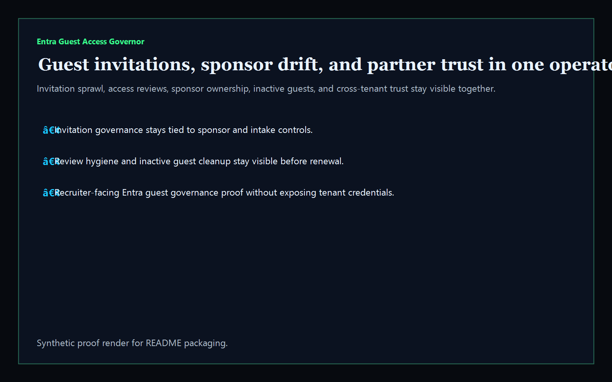
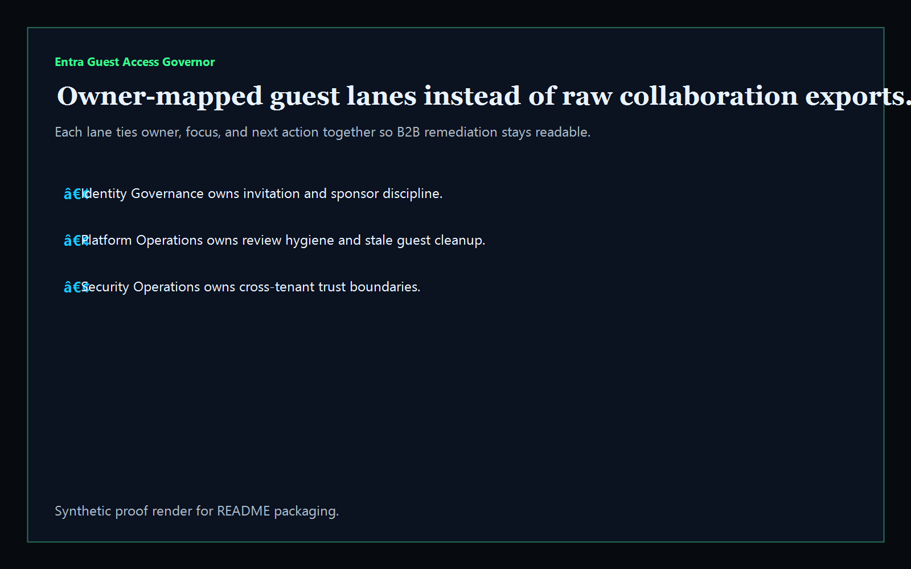
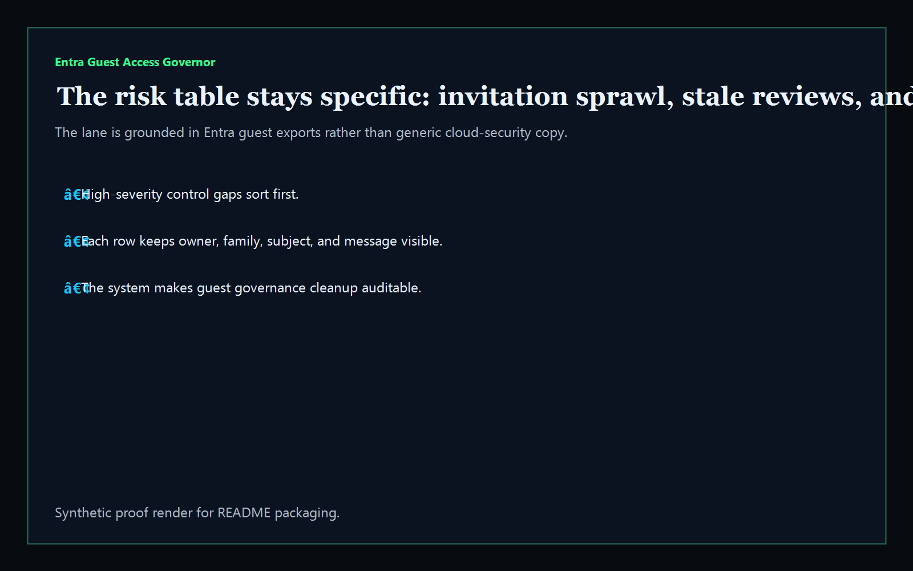
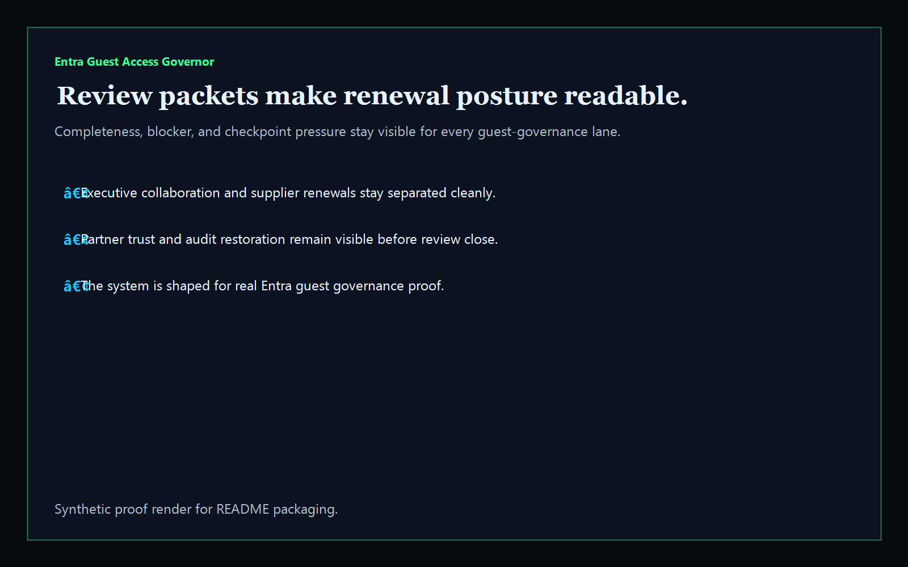

# entra-guest-access-governor

[](https://github.com/mizcausevic-dev/entra-guest-access-governor/actions/workflows/ci.yml)
[](https://github.com/mizcausevic-dev/entra-guest-access-governor/actions/workflows/pages.yml)

Operator control plane for Entra guest access governance, invitation sprawl, sponsor drift, cross-tenant trust posture, inactive guest cleanup, and remediation sequencing.

## Production status

| Aspect | Status |
|--------|--------|
| Deploy | Static prerender -> **https://guest.kineticgain.com/** |
| Data posture | Synthetic guest users, review packets, sponsor mappings, and cross-tenant policy snapshots only; no live identities, tenant IDs, or secrets are committed |

## Why this matters

- B2B guest access breaks at invitation sprawl, inactive accounts, stale sponsors, weak cross-tenant trust settings, and missing access reviews long before security or audit teams get a clean answer.
- Recruiters looking for `Entra / Azure AD / guest access / identity governance / access reviews` proof should see a real operator dashboard, not generic cloud copy.
- This repo turns guest identity drift into one control plane for review cadence, sponsor ownership, external collaboration posture, and guest cleanup.

## Why this matters (KG Embedded tie-back)

This repo demonstrates the guest-access governance primitive for Kinetic Gain Embedded: guest user snapshots, sponsor evidence, review posture, and remediation packets in one operator surface. Kinetic Gain Embedded extends this pattern into in-app identity-governance panels where teams need evidence-rich B2B access visibility without exposing raw admin consoles or live tenant credentials.

## What it shows

- `guest-lane` visibility for invitation governance, access review hygiene, sponsor ownership, and cross-tenant trust
- `access-gaps` detection for invitation sprawl, orphaned guests, missing reviews, inactive guests, telemetry gaps, and sponsor handoff issues
- `review-posture` packets that tie owner, blocker, timing, and completeness together
- offline-safe analysis of captured Entra guest-access and cross-tenant exports
- recruiter-facing Entra / IAM / B2B access governance proof that complements the Conditional Access and Intune lanes

## Routes

- `/`
- `/guest-lane`
- `/access-gaps`
- `/review-posture`
- `/verification`
- `/docs`

## API

- `/api/dashboard/summary`
- `/api/guest-lane`
- `/api/access-gaps`
- `/api/review-posture`
- `/api/verification`
- `/api/sample`

## Screenshots






## CLI

```powershell
npx entra-guest-access-governor fixtures/entra-guest-hotspots.json `
  --format markdown `
  --fail-on-high
```

## Validation

- `npm run verify`
- `npm run prerender`
- `npm run render:assets`

## Local development

```powershell
cd entra-guest-access-governor
npm install
npm run dev
```

Then open:

- [http://127.0.0.1:5524/](http://127.0.0.1:5524/)
- [http://127.0.0.1:5524/guest-lane](http://127.0.0.1:5524/guest-lane)
- [http://127.0.0.1:5524/access-gaps](http://127.0.0.1:5524/access-gaps)
- [http://127.0.0.1:5524/review-posture](http://127.0.0.1:5524/review-posture)

## Packaging

| Item | Value |
|---|---|
| License | `AGPL-3.0-or-later` |
| CNAME | `guest.kineticgain.com` |
| Live site | [https://guest.kineticgain.com/](https://guest.kineticgain.com/) |
| Deploy | Static prerender -> GitHub Pages |

## Docs

- [docs/KINETIC_GAIN_EMBEDDED.md](./docs/KINETIC_GAIN_EMBEDDED.md)

## Related

- [**`conditional-access-posture-board`**](https://github.com/mizcausevic-dev/conditional-access-posture-board) — tenant policy and exclusion proof
- [**`entra-access-review-control-plane`**](https://github.com/mizcausevic-dev/entra-access-review-control-plane) — broader access review workflow proof
- [**`okta-access-review-orchestrator`**](https://github.com/mizcausevic-dev/okta-access-review-orchestrator) — adjacent identity-review operating surface

## Part of the Kinetic Gain Suite

Operator surface in the [Kinetic Gain Suite](https://suite.kineticgain.com/) — a portfolio of buyer-readable control planes spanning security posture, compliance evidence, identity governance, data-platform reliability, and operator workflows. Apex: [kineticgain.com](https://kineticgain.com/).
